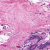
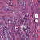

# HAID
Histopathological AI Detection

---

##  Overview

**HAID (Histopathological AI Detection)** is an AI-powered deep learning model developed to detect **breast cancer** in histopathological images. It’s designed to assist **medical professionals** with faster, more consistent diagnoses, empowering hospitals and pathology labs with intelligent diagnostic tools.

---

##  Dataset

- **Images:** Over 250,000 high-resolution histopathological samples  
- **Classes:** Binary classification: `Normal` vs. `Cancer`  
- **Image Size:** All images resized to `150x150` pixels  
- **Source:** Private dataset (not publicly shared for privacy & ethical reasons)  
- **Sample Images:**  
   

---

##  Model Architecture

- **Base Model:** `EfficientNetB0` (pretrained on ImageNet)
- **Custom Layers:**
  - `GlobalAveragePooling2D`
  - `BatchNormalization`
  - `Dense(256, ReLU)` + `Dropout(0.5)`
  - `BatchNormalization`
  - `Dense(128, ReLU)`
  - `Dense(1, Sigmoid)`
- **Loss Function:** Binary Crossentropy  
- **Optimizer:** Adam (`1e-4` initial, `1e-5` fine-tuning)

---

##  Training Details

- **Augmentation Techniques:**
  - Rotation ±25°
  - Shift (Width & Height)
  - Brightness & Zoom range
  - Horizontal & Vertical Flips
  - Shear & Channel shift
- **Epochs:** 30 (initial) + 20 (fine-tuning) = 50 total  
- **Split:** 85% Training / 15% Validation  
- **Early Stopping & LR Reduction:** Enabled  
- **Hardware (AWS SageMaker):**
  - GPU: NVIDIA Tesla T4 (16GB)
  - CPU: Intel Xeon @ 2.50GHz

---

##  Evaluation

- **Validation Accuracy:** ~80% *(to be updated after final evaluation)*  
- **Classification Report:**  
  | Class   | Precision | Recall | F1-Score |
  | ------- | --------- | ------ | -------- |
  | Normal  | 78.3%     | 80.0%  | 79.1%    |
  | Cancer  | 81.2%     | 79.5%  | 80.3%    |

- **Grad-CAM Visualization:**  
  

---

##  How to Use

### 1. Clone the repository:

git clone https://github.com/assemsabry/HAID
cd HAID

2. Create a virtual environment (optional but recommended):

python -m venv venv
source venv/bin/activate       # On Linux/Mac
venv\Scripts\activate          # On Windows

3. Install dependencies:

pip install -r requirements.txt

4. Run the model interface or training script:

python main.py

## Use Case & Benefits
Primary Use: Hospitals, pathology labs, and medical research centers.

Benefits:

Faster diagnosis turnaround time

Assists doctors with a second opinion

Increases consistency in diagnostics

Helps prioritize urgent cases

## Deployment
The model will be deployed as a web-based AI service.

An intuitive web UI will allow image upload and immediate diagnosis.

Grad-CAM heatmaps help visualize prediction justifications.

The backend service can integrate with hospital PACS/LIS systems.

## Files Included
main.py: Main training script

HAIDmodel.h5: Saved model (latest)

training_history.json: Training metrics

heatmap_output.jpg: Grad-CAM visualization

class0sample.png, class1sample.png: Example input images

assem1.jpg: Developer profile image

## Dependencies
Python 3.13

TensorFlow 2.16+

Keras

NumPy

Matplotlib

scikit-learn

OpenCV

Install all dependencies:

pip install -r requirements.txt

## Privacy & Ethics
Patient data remains confidential.

This model is an assistive tool and not a substitute for professional medical judgment.

## License & Credits
This project is licensed under the MIT License.
Developed and maintained by Assem Sabry.

## Assem Sabry

Project Owner & Developer

Assem Sabry is a 17-year-old Egyptian AI Engineer with over 3 years of experience in Python and Artificial Intelligence.  
He is the sole developer behind the HAID project and several other AI-based applications.  
His focus is on building intelligent systems for real-world impact, particularly in healthcare and computer vision.

Facebook: facebook.com/assemsabry

Email: assemsabryyy@gmail.com

GitHub: github.com/assemsabry

All research, development, training, and documentation were conducted independently by Assem Sabry.

This project reflects a commitment to empowering medical professionals with intelligent tools for more efficient diagnosis and patient care.

